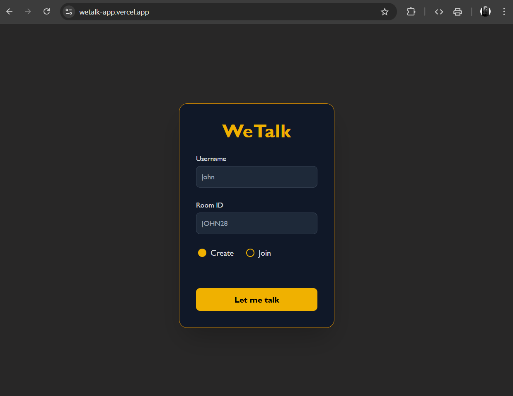

# 🗨️ WeTalk – Real-Time Chat Application

WeTalk is a **real-time group chat web app** built using **WebSockets**. Users can create or join chat rooms instantly, exchange messages with others in real-time, and enjoy a smooth and responsive interface.

---

## 🪟 Screenshots

    
    

---

## 🚀 Features

- **Create or Join Rooms** – Start a new chat room or join one using a room ID.  
- **Real-Time Messaging** – All messages are instantly synced between connected users.  
- **Rejoin Support** – Automatically reconnect to your previous room after refresh.  
- **Lightweight & Fast** – Minimal latency with WebSockets.  
- **Responsive UI** – Works on desktop and mobile.

---

## 🛠️ Tech Stack

**Frontend:**
- React.js  
- Tailwind CSS  

**Backend:**
- Node.js  
- WebSockets

---

